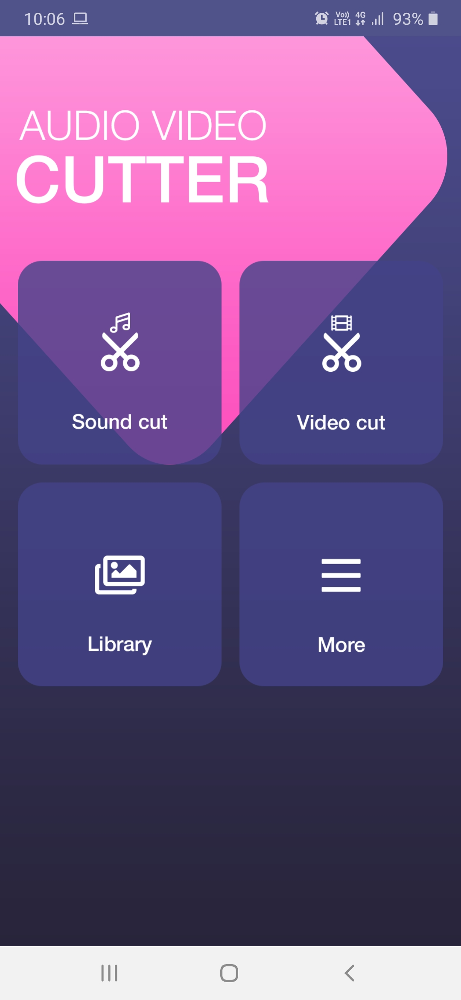
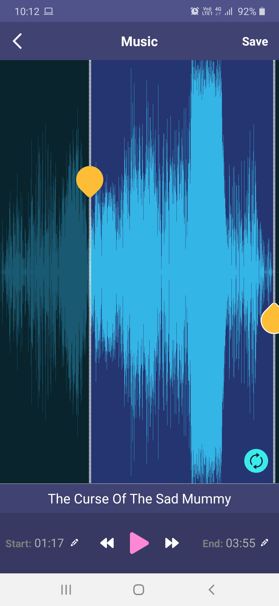
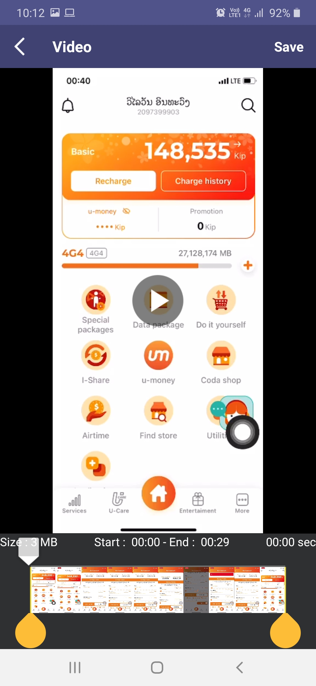

# Audio - Video Cutter

## Description
Ứng dụng hỗ trợ cắt nhạc định dạng .mp3, .aac, .m4a, .flac, .wav để làm nhạc chuông độc đáo cho điện thoại, làm báo thức, thông báo tin nhắn và cắt video định dạng .3gp, .mp4, .mpeg, .wmv, .avi để xuất bản lên mạng xã hội như facebook, youtube, tiktok, instagram...

## Link app: 
[Demo](https://github.com/quangda280296/audio_video_cutter/blob/master/app/release/app-release.apk)

## Screenshots
![]

